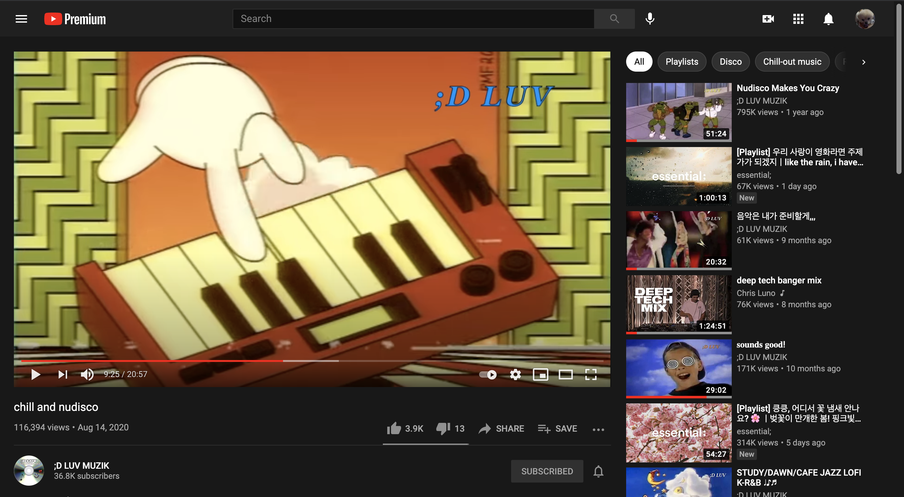

# General Assembly Data Science Final Project

I participated in GA data science track. The track is taught by experienced data scientists, it is a part-time, 10-week course in a development environment, python foundations, exploratory data analysis, data visualization, and machine learning.  

# Final Project 

# Background
There are different ways that people enjoy music. More and more people listen to music using Spotify, Youtube, or Twitch. As a person who loves listening to music, I recently found interesting trends on youtube. Some people created youtube channels and post music playlists or music mix sets with eye-catching visual graphics suited to the music playlists.

Example of music playlist on Youtube: https://www.youtube.com/watch?v=yEwoWiKnZ5c&t=563s

Some of these music playlist youtube channels are owned by major music labels or companies to promote their artist's music. However, there are also a lot of youtube channels that individuals own.

# Project Goal
I wanted to find a way to provide some insights on promoting music playlist youtube channels to those individuals.

# Data Collection 

To investigate, I used two datasets.

One is the dataset from specific music playlist youtube channels that have many viewers and subscribers. The other is the youtube trending videos. 

* The first dataset includes, 

  - video_id: ID of video recommended as trending video
  - publish_time: Date and time when video was published
  - title: Title of video
  - channel_id: ID of youtube channels 
  - channel_title: name of youtube channels
  - tags: Tags associated with video
  - views_count: Number of views on video
  - likes_count: Number of likes on video
  - dislikes_count: Number of dislikes on video
  - favorites_count: Number of favorites on video
  - comments_count: Number of comments on video
  - duration: the duration of video
  - subscribers: the number of channel subscribers 

The dataset is from targeted youtube channels, and I chose those channels based on their popularity. All of them have more than 1K views. Most of those youtube channels are based in the US and Korea. I used Youtube API to scrape data, and I used "Python Engineer" Youtube videos and github repository as a reference. 

Youtube Data API Video Tutorials :https://youtube.com/playlist?list=PLqnslRFeH2UpC8EqlF2aax9A-VLiPDwxP

Code: https://github.com/python-engineer/youtube-analyzer

* The second dataset includes, 
  - video_id: ID of video recommended as trending video
  - trending_date: Date recommended as trending video
  - title: Title of video
  - channel_title: Channel title of video
  - category_id: ID of video category (associated with separate json file)
  - publish_time: Date and time when video was published
  - tags: Tags associated with video
  - views: Number of views on video
  - likes: Number of likes on video
  - dislikes: Number of dislikes on video
  - comment_count: Number of comments on video
  - thumbnail_link: Thumbnail link of video
  - comments_disabled: Whether or not comments disabled for video
  - ratings_disabled: Whether or not ratings disabled for video
  - video_error_or_removed: Whether or not video has error or removed.
  - description: Description of video

The dataset is from Kaggle, a famous online community of data scientists and machine learning practitioners. Youtube maintains a list of the top trending videos on the platform, and these data are based on that list. Also, the data set only includes data from the US and Canada. But I only included the video data categorized as 10 (aka Music) since my project targeted youtube videos that are mainly focused on music content. 

Kaggle: https://www.kaggle.com/datasnaek/youtube-new

I decided to compare two data sets instead of one since the first data set only includes music playlist video contents.  The second data set can help to understand the insights that I had from the first data set. 

# Conclusion and Insights 
Based on the analysis and models, I concluded that

* To make viewers like the video content, encouraging people to write comments about video content is essential.
* The number of comments was the most highly associated with the number of likes. This result may seem obvious
because if people like the video, they would be more likely to write comments about it
and press the like button on the screen.
* The interesting insight is the association between the number of likes and dislikes.
Surprisingly, both are associated with each other even though these features indicate opposite opinions about video contents. In my opinion, to dislike video content, at least people need to be interested in video content to have an opinion. If viewers don't care about the video, likely, viewers are not going to express their opinion by pressing likes or dislikes on the screen. Therefore, disliking a video can be another way to express interest in the video.

My suggestion for YouTubers who own their music playlist youtube channel, it is a good idea to get feedback about a video from the comments, especially the video content with many dislikes. It could be a good way to find what should be improved to promote the channels.
